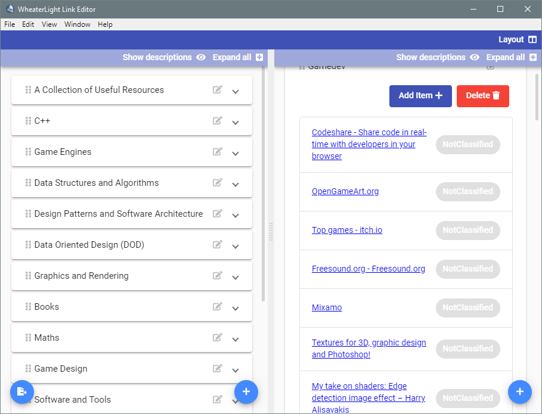
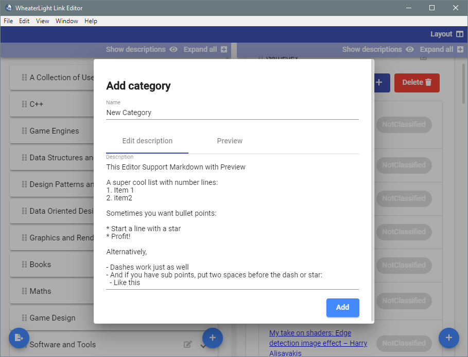

# WL Link Editor 

Simple program to organize a collection of links

## Screenshots





## Getting Started

These instructions will get you a copy of the project up and running on your local machine for development and testing purposes. See deployment for notes on how to deploy and build the project for the target platform.

### Prerequisites

The only needed software is [NodeJS](https://nodejs.org/en/)

### Installing

A step by step series of examples that tell you how to get a development env running

1. First clone the repository
    ```
    git clone 
    ```
2. Run npm for installing dependencies 
    ```
    npm install
	```

End with an example of getting some data out of the system or using it for a little demo

## Tests

_Tests need to be written_
Currently the test file are present but are only stubs. 

## Deployment

For deployment this are scripts executable with npm:
>This scripts are provided by the npm package [Electron-Builder](https://github.com/electron-userland/electron-builder) so for further documentation look up the github repository.

| Command   | Description   |
|---|---|
| ```npm run electron:linux```  | Builds the application and creates an app executable on linux systems  |
| ```npm run electron:windows```  | On a Windows OS, builds your application and creates an app executable in windows 32/64 bit systems  |
| ```npm run electron:mac```  | On a MAC OS, builds your application and generates a .app file of your application that can be run on Mac  |

## Built With

* [Angular](https://angular.io/) - Renderer
* [Electron](https://electronjs.org/) - For cross platform desktop app
* [Angular Material](https://material.angular.io/) - UI toolkit

## Contributing

the contributing guidelines are still to be estabilisced

## Authors

* **Luca Faggion** - *Initial work* - [darkimage](https://github.com/darkimage)

See also the list of [contributors](https://github.com/your/project/contributors) who participated in this project.

## License

This project is licensed under the MIT License - see the [LICENSE.md](LICENSE.md) file for details
